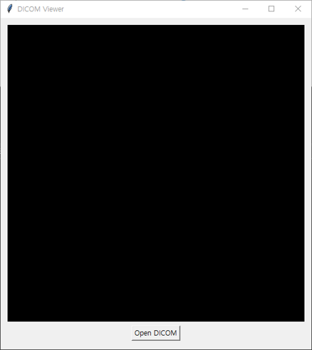
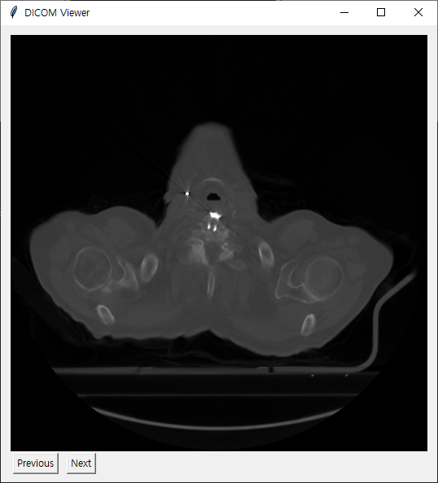
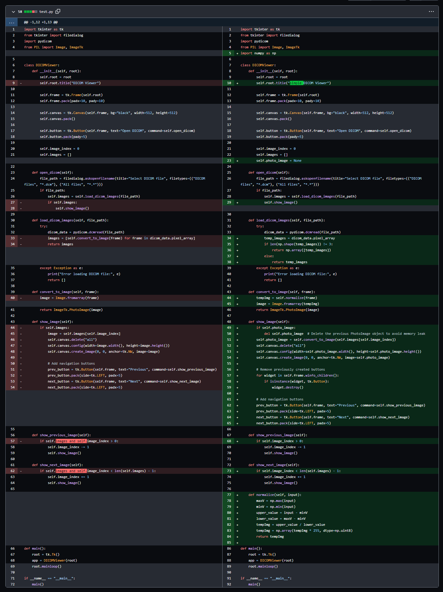

## Simple Dicom Viewer Project

### 간단한 DICOM 영상 뷰어를 제작해보도록 하겠습니다.

Fig 1. 프로그램 그림




준비물
1. 미리 설치된 파이썬
2. 파이썬 패키지: pydicom, numpy, pyinstaller

코드 작성
1. OpenAI의 chatGPT에서 프롬프트로 코드 생성
   
   Prompts>
   
   1> 파이썬으로 pydicom tkinter로 dicom image viewer를 만드는 코드를 작성해줘.
   
   2> 첫번째 코드에서 dicom파일이 여러 장의 영상을 가지고 있을 경우 하나씩 보여주는 코드를 작성해줘.
   
   3> previous와 next 버튼이 계속 생성되는 것을 막아줘.
   
3. 원하는 기능들을 추가 수정하여 코드 완성



쉘에서 실행 기준
파이썬 패키지 설치
```python
C:\pip install pydicom numpy pyinstaller
```

코드를 실행해보고 결과 확인
```python
C:\python simpledicomviewer.py
```

pyinstaller로 랩핑
```python
C:\pyinstaller -w -F simpledicomviewer.py --hidden-import=pydicom.encoders.gdcm --hidden-import=pydicom.encoders.pylibjpeg
```

완료 후 dist폴더에서 *.exe파일 생성이 되면 실행


만일 에러가 뜨면서 hiddenimports로 인해 실행되지 않을 경우
simpledicomviewer.spec 파일을 텍스트편집기에서 열고서
```
hiddenimports=['에러가 발생한 패기지들 이름들을 열거','에러가 발생한 패기지들 이름들을 열거'],
```
수정후
```python
C:\pyinstaller simpledicomviewer.spec
```

완성
