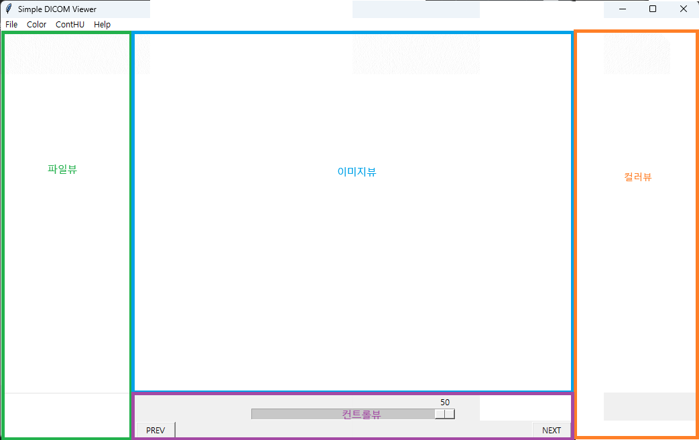

## Simple Dicom Viewer Project

*** 참고사항: 가상환경에서 패키지를 최소화해서 설치하시면 프로그램 크기가 작습니다. 20MB근처입니다.

***          패키지를 최소화하지 않고 설치하시면 저같은 경우 텐서플로 등등 모두 140MB크기의 실행파일이 만들어집니다.

### 간단한 DICOM 영상 뷰어를 제작해보도록 하겠습니다.

Fig 1. 프로그램 그림


준비물
1. 미리 설치된 파이썬
2. 파이썬 패키지: pydicom, numpy, pyinstaller
   
  (만일 설치되지 않으면 pip로 설치, 이후 설명)

코드 작성
1. OpenAI의 chatGPT에서 프롬프트로 코드 생성
   
   Prompts>
   
   1> 파이썬으로 pydicom tkinter로 dicom image viewer를 만드는 코드를 작성해줘.
   
   2> 첫번째 코드에서 dicom파일이 여러 장의 영상을 가지고 있을 경우 하나씩 보여주는 코드를 작성해줘.
   
   3> previous와 next 버튼이 계속 생성되는 것을 막아줘.
   
3. 원하는 기능들을 추가 수정하여 코드 완성


완성된 코드는 sdv002.py 이므로 이를 다운로드

쉘에서 실행 기준
파이썬 패키지 설치

실행 폴더는 각자 원하는 폴더로 설정 후 명령어만 입력

쉘을 실행시키는 방법은 윈도 명령줄의 검색 창에 cmd를 입력 후 관리자 권한으로 실행

```python
C:\pip install pydicom numpy pyinstaller pillow
```

코드를 실행해보고 결과 확인
```python
C:\python sdv002.py
```

pyinstaller로 랩핑
```python
C:\pyinstaller -w -F sdv002.py --hidden-import=pydicom.encoders.gdcm --hidden-import=pydicom.encoders.pylibjpeg
```

완료 후 dist폴더에서 *.exe파일 생성이 되면 실행

에러발생이 없으면 여기서 완성

실행파일은 dist 폴더에 생성됨

실행 시 바이러스 검색에서 필터링이 되면 백신프로그램 실시간 감시를 끄고서 실행


만일 hiddenimports 에러로 인해 실행되지 않을 경우
sdv002.spec 파일을 텍스트편집기에서 열고서
```
hiddenimports=['에러가 발생한 패기지들 이름들을 열거','에러가 발생한 패기지들 이름들을 열거'],
```
수정후
```python
C:\pyinstaller sdv002.spec
```

완성

업데이트 준비 중인 모습입니다.


